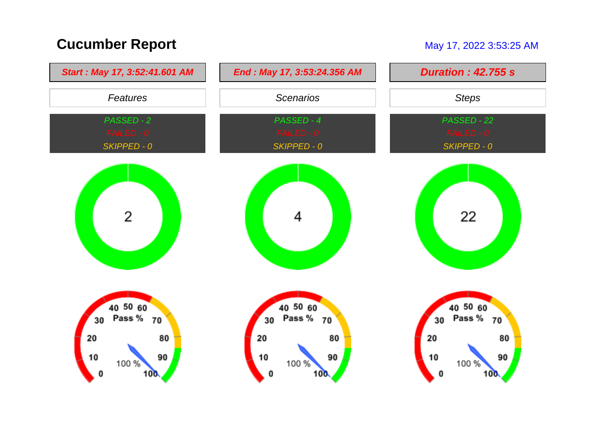
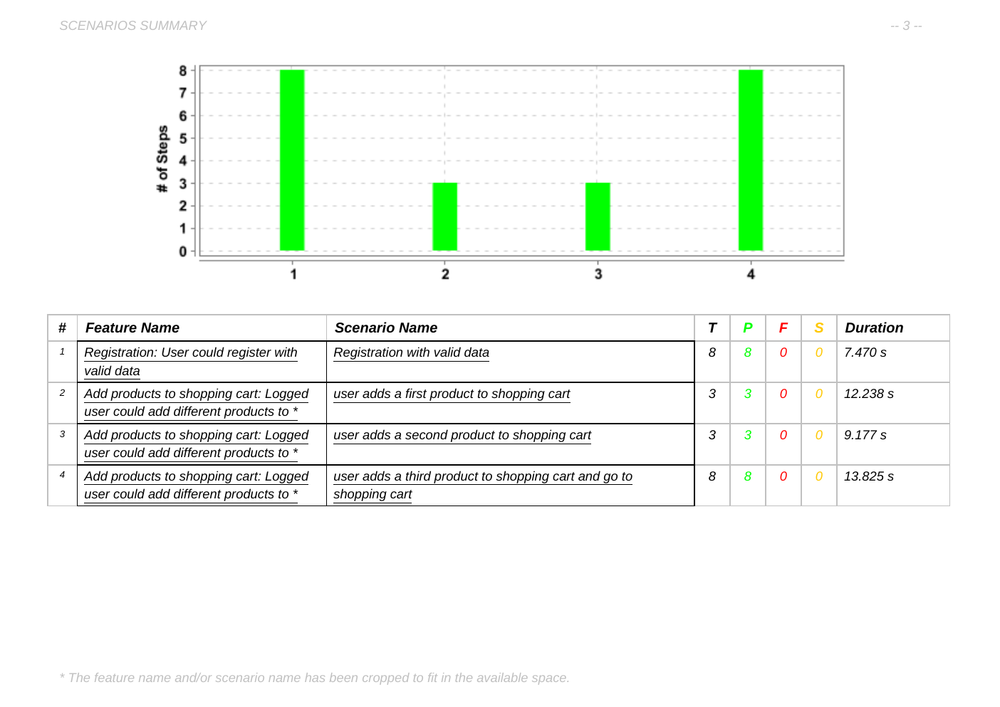
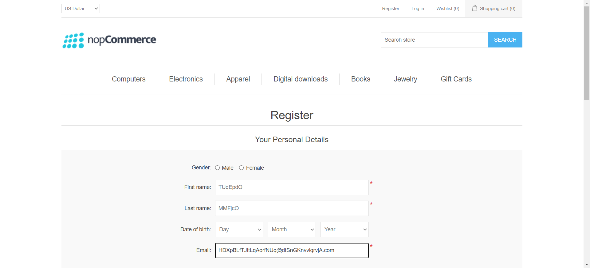
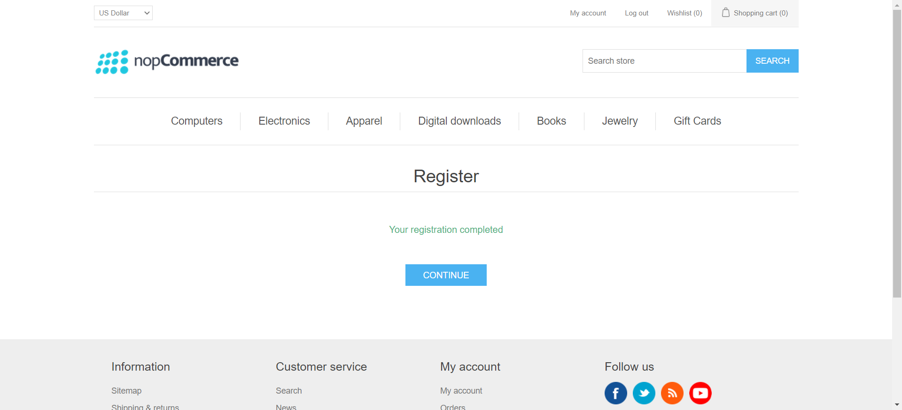
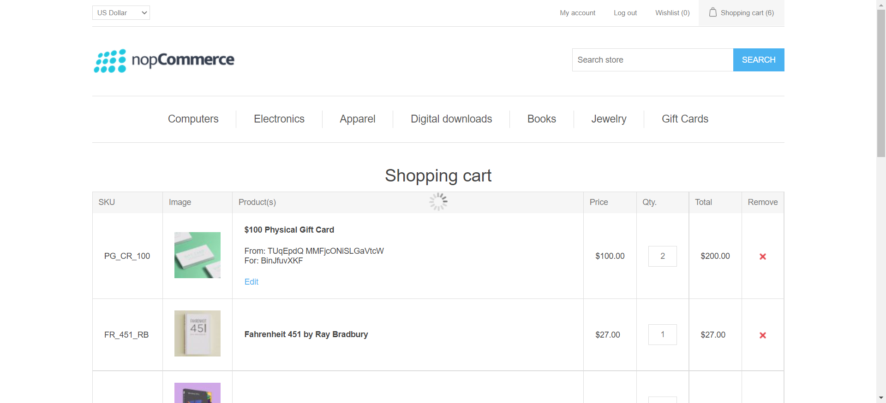
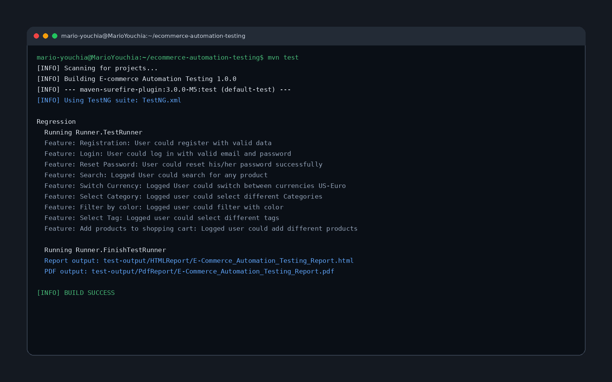

# E-commerce Automation Testing

This project documents a Java automation-testing workflow for a nopCommerce demo website. It combines Selenium WebDriver browser automation, Cucumber BDD feature files, TestNG runners, Page Object classes, Maven dependency management, screenshot capture, and Extent Reports HTML/PDF reporting.

## Preview



The preserved final generated report shows a successful run with 2 passed features, 4 passed scenarios, and 22 passed steps.



The scenario summary documents the executed registration and shopping-cart flows, including scenario durations and step counts.



The registration flow fills the e-commerce registration form using generated valid user data.



The automation verifies the successful-registration confirmation before continuing through the test flow.



The shopping-cart scenario adds multiple products and updates item quantities as part of the end-to-end cart behavior.



The terminal run summary shows the automation suite executing through Maven/TestNG and generating the final HTML/PDF report outputs.

## Main Features

* Selenium WebDriver browser automation
* Cucumber BDD feature files
* TestNG runner configuration
* Page Object Model structure
* Maven project configuration
* Extent Reports HTML/PDF reporting with screenshot attachments
* Utility helpers for test data, category/product handling, reporting, and completion alerts
* Implemented e-commerce flows for registration, login, password reset, search, currency switching, category selection, color filtering, tag selection, and shopping-cart behavior
* Preserved final generated report with HTML, PDF, and screenshot evidence

## Implemented Feature Coverage

| Feature file | Coverage |
|---|---|
| `F00_Initialization.feature` | Initializes shared variables and website category/search data |
| `F01_Registration.feature` | User registration with valid generated data |
| `F02_Login.feature` | Login with valid email and password |
| `F03_ResetPassword.feature` | Password reset using valid email |
| `F04_Search.feature` | Product search |
| `F05_SwitchCurrency.feature` | Currency switching |
| `F06_SelectCategory.feature` | Category and subcategory selection |
| `F07_ColorFilter.feature` | Product filtering by color |
| `F08_SelectTag.feature` | Product-tag selection |
| `F09_ShoppingCart.feature` | Add products to cart and update cart quantities |
| `F13_FinishTesting.feature` | Test-finish reporting and alert handling |

## Generated Report Evidence

The original archive contained generated reports from multiple test runs. This cleaned version keeps the strongest final successful run instead of storing every historical generated output.

| Evidence | Path |
|---|---|
| HTML report | `docs/generated-report/final-success-run/test-output/HTMLReport/E-Commerce_Automation_Testing_Report.html` |
| PDF report | `docs/generated-report/final-success-run/test-output/PdfReport/E-Commerce_Automation_Testing_Report.pdf` |
| Attached screenshots | `docs/generated-report/final-success-run/test-output/Screenshots/` |

Final preserved run:

| Measure | Result |
|---|---:|
| Passed features | 2 |
| Failed features | 0 |
| Passed scenarios | 4 |
| Failed scenarios | 0 |
| Passed steps | 22 |
| Failed steps | 0 |
| Attached screenshots | 22 |

## Technical Overview

The project uses Cucumber feature files to describe user-facing e-commerce scenarios. Java step definitions connect those scenarios to Selenium WebDriver actions. Page Object classes keep page-specific locators and interactions organized, which makes the test flow easier to maintain than placing all selectors directly inside step definitions.

The main automation target is the demo e-commerce website configured in `Hooks.java`. The test setup initializes Chrome through WebDriverManager, navigates to the target website, prepares page objects, captures screenshots after each Cucumber step, and closes the browser after each scenario.

The TestNG suite runs the configured Cucumber runners. The main `TestRunner` currently uses the `@Smoke9` tag selection, while `FinishTestRunner` handles the finish/reporting utility flow. Extent Reports is configured through `extent.properties` and `spark-config.xml` to generate HTML/PDF reports and screenshots under the configured output folders.

## How to Run

Install Java, Maven, and Google Chrome, then run from the project root:

```bash
mvn test
```

The Maven Surefire configuration uses:

```text
TestNG.xml
```

The main runner is configured in:

```text
src/test/java/Runner/TestRunner.java
```

The reporting configuration is located in:

```text
src/test/resources/extent.properties
src/test/resources/spark-config.xml
```

Generated reports are configured to be written under:

```text
test-output/
GeneratedReports/
```

## Limitations

This is a course/personal automation-testing project built around a live demo e-commerce website. If the target website changes its UI, selectors, products, categories, or page behavior, some locators and test steps may need to be updated. Draft wishlist, compare-list, and order feature files from the original archive were not kept as active coverage because they were not backed by the final implemented step-definition set.
